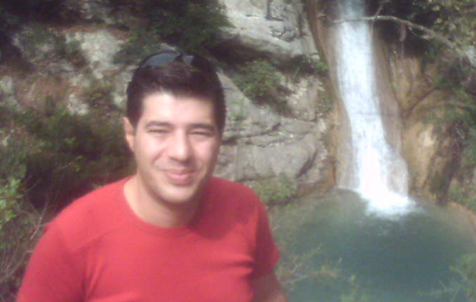



<a href="archive.html" class="pull-right" style="margin-top:8px">see all...</a>
<h3>News and Blog posts</h3>
<ul class="unstyled">
  
    <li>{{ post.date | date: "%d.%m.%y" }} <a href="{{ BASE_PATH }}{{ post.url }}">{{ post.title }}</a></li>
  
</ul>

<h3>Categories</h3>
<ul class="tag_box inline">
  
  
</ul>
 

<h3>Tags</h3>
<ul class="tag_box inline">
    
  
</ul>

I am a PhD Student, Researcher under the supervision of [Prof. Yannis Vassiliou](http://www.dblab.ntua.gr/people/yv.html), at the 
[School of ECE](http://www.ece.ntua.gr) of the [National Technical University of Athens](http://www.ntua.gr), Greece, and a member of
[Knowledge &amp; Database Systems](http://www.dblab.ntua.gr/) group.

**Research interests.** Information retrieval, network analysis, diversification, web search

